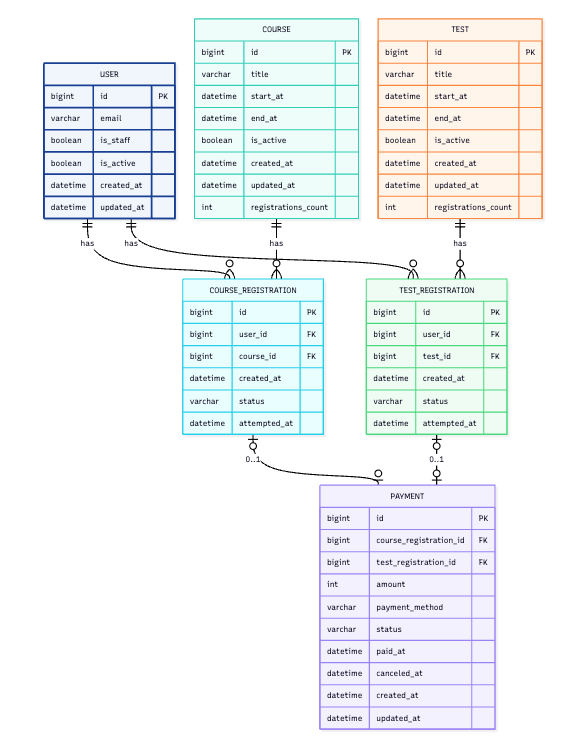
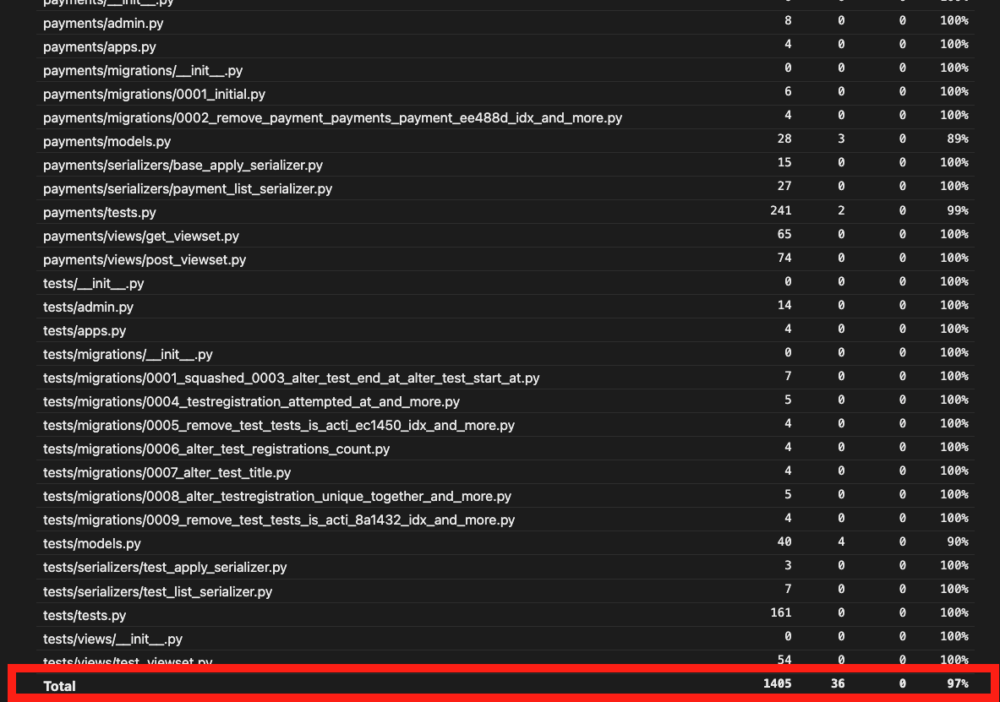

# Grepp 과제 전형 📑
- 응시자 : 조재영
- 개발 기간 : 2025년 9월 25일 ~ 2025년 9월 29일

<br>

# 목차 📚
- [실행 방법 (seed data 생성)](#start)
- [API 문서 & swagger](#api)
- [개발하며 신경썼던 부분](#point)
- [ERD](#erd)
- [폴더 구조](#dir_structure)
- [테스트 코드 커버리지](#test_code)
- [개선 포인트](#road_map)

<br>

<a id="start"></a>
# 실행 방법 (seed data 생성) 🏃
docker 가 설치되어있어야 합니다. <br>
docker install : https://docs.docker.com/engine/install/

<br>

### 1. 프로젝트 다운
```shell
git clone https://github.com/JaeYoung-Cho-95/grepp-assignment.git
```

### 2. 최초 실행
"docker container 띄우기 > migration > seed dummy data 만들기" 과정을 한번에 진행합니다.
```shell
sh start_with_make_seed_data.sh
```

### 3. 서버 내리기
```shell
docker compose down
```

### 4. 다시 서버 올리기 (데몬)
```shell
docker compose up -d
```


<br>

<a id="api"></a>
# API 문서 & Swagger 📋
- Base URL: `http://localhost:8000`
- 인증: Bearer JWT (로그인으로 `access` 발급 후 `Authorization: Bearer <token>` 헤더 사용)
- 스웨거 
    - url : `http://localhost:8000/admin`
    - login 에 적혀있는 example body 에 적혀있는 id / password 그대로 사용 가능합니다.
    - access token 만 복사해 우측 상단 authorize 에 붙여넣기
- admin
    - url : `http://localhost:8000/api/docs`
    - id : admin@example.com
    - password : admin1234

<br>

## 유저

#### 회원가입
- Method/Path: `POST /signup`
- Auth: 필요 없음
- Request:
  - `email` (string)
  - `password` (string)
- Responses:
  - 201 Created: 
    ```json
    {
        "id": "number", 
        "email": "string", 
        "created_at": "datetime"
    }
    ```
  - 400 Bad Request: 유효성 실패

#### 로그인
- Method/Path: `POST /login`
- Auth: 필요 없음
- Request:
  - `email` (string)
  - `password` (string)
- Responses:
  - 200 OK: 
    ```json
    {
        "refresh": "string", 
        "access": "string"
    }
    ```
  - 401 Unauthorized: 인증 실패

<br>

## 수업

#### 수업 목록 조회
- Method/Path: `GET /courses`
- Auth: 필요
- Query:
  - `status` (string, optional): `available`
  - `sort` (string, optional): `created` | `popular`
  - `limit` (int, optional, default 20, max 100)
  - `offset` (int, optional)
- Responses:
  - 200 OK:
    ```json
    {
      "count": "number",
      "next": "string|null",
      "previous": "string|null",
      "results": [
        {
          "id": "number",
          "title": "string",
          "registrations_count": "number",
          "start_at": "datetime",
          "end_at": "datetime",
          "is_registered": true
        }
      ]
    }
    ```
  - 400 Bad Request: 잘못된 쿼리
  - 401 Unauthorized

#### 수업 수강 신청
- Method/Path: `POST /courses/{course_id}/enroll`
- Auth: 필요
- Request:
  - `amount` (int, > 0)
  - `payment_method` (string): `card` | `kakaopay` | `naverpay` | `tosspay` | `bank_transfer`
- Responses:
  - 201 Created: 
    ```json
    {
        "registration_id": "number", 
        "payment_id": "number", 
        "status": "paid"
    }
    ```
  - 400 Bad Request | 404 Not Found | 409 Conflict

#### 수업 완료 처리
- Method/Path: `POST /courses/{course_id}/complete`
- Auth: 필요
- Request: -
- Responses:
  - 200 OK: 
    ```json
    {
    "registration_id": "number", 
    "status": "completed"
    }
    ```
  - 400 Bad Request | 404 Not Found | 409 Conflict

<br>

## 시험

#### 시험 목록 조회
- Method/Path: `GET /tests`
- Auth: 필요
- Query:
  - `status` (string, optional): `available`
  - `sort` (string, optional): `created` | `popular`
  - `limit` (int, optional, default 20, max 100)
  - `offset` (int, optional)
- Responses:
  - 200 OK:
    ```json
    {
      "count": "number",
      "next": "string|null",
      "previous": "string|null",
      "results": [
        {
          "id": "number",
          "title": "string",
          "registrations_count": "number",
          "start_at": "datetime",
          "end_at": "datetime",
          "is_registered": "boolean"
        }
      ]
    }
    ```
  - 400 Bad Request: 잘못된 쿼리
  - 401 Unauthorized

#### 시험 응시 신청
- Method/Path: `POST /tests/{test_id}/apply`
- Auth: 필요
- Request:
  - `amount` (int, > 0)
  - `payment_method` (string): `card` | `kakaopay` | `naverpay` | `tosspay` | `bank_transfer`
- Responses:
  - 201 Created: 
    ```json
    {
        "registration_id": "number", 
        "payment_id": "number", 
        "status": "paid"
    }
    ```
  - 400 Bad Request | 404 Not Found | 409 Conflict

#### 시험 응시 완료
- Method/Path: `POST /tests/{test_id}/complete`
- Auth: 필요
- Request: -
- Responses:
  - 200 OK: 
    ```json
    {
        "registration_id": "number", 
        "status": "completed"
    }
    ```
  - 400 Bad Request | 404 Not Found | 409 Conflict

<br>

## 결제

#### 내 결제내역 조회
- Method/Path: `GET /me/payments`
- Auth: 필요
- Query:
  - `status` (string, optional): `paid` | `cancelled`
  - `from` (date, optional, YYYY-MM-DD)
  - `to` (date, optional, YYYY-MM-DD)
- Responses:
  - 200 OK:
    ```json
    [
      {
        "id": "number",
        "amount": "number",
        "payment_method": "string",
        "item_title": "string|null",
        "status": "pending|paid|cancelled|failed|refunded",
        "can_refund": "boolean",
        "attempted_at": "datetime|null"
      }
    ]
    ```
  - 400 Bad Request: 잘못된 쿼리
  - 401 Unauthorized

#### 결제 취소
- Method/Path: `POST /payments/{payment_id}/cancel`
- Auth: 필요
- Request: -
- Responses:
  - 200 OK: 
    ```json
    {
        "detail": "결제가 취소되었습니다.",
        "registration_id": "number",
        "payment_id": "number",
        "status": "cancelled"
    }
    ```
  - 400 Bad Request | 403 Forbidden | 404 Not Found | 409 Conflict

<br>

<a id="point"></a>
# 개발하며 신경썼던 부분 ✅

### 수업/시험 조회
1. N+1 예방
2. 정렬 / 필터에 대한 인덱싱 (비즈니스 관점에서 테스트/수업에 대한 write 가 많이 없다고 추측)
3. 페이지네이션 적용
4. 시험/수업 조회 공통 로직 Registrable 추상화

### 수업/시험 신청 및 결제
1. transaction.atomic()으로 신청 생성과 결제 생성을 하나의 트랜잭션으로 처리
2. 수업 및 시험 중복 신청 검증
3. 신청/완료 공통 로직(Registrable) 추상화

### 결제 취소
1. select_for_update()로 결제/신청 레코드 비관적 락킹 후 트랜잭션 내 상태 전이
2. '결제 소유자 확인', '완료/이미 취소된 내역 거부', '취소 가능 상태(수업 완료 시 거부)' 등 검증
3. 결제 취소 시 소프트 delete 방식을 선택 > 연결된 registration 도 status 상태값 전이


<br>

<a id="erd"></a>
# ERD 



<br>

<a id="dir_structure"></a>
# 폴더 구조 🗂️
```
/assignment
  ├─ accounts/                      # 사용자 앱
  │  ├─ migrations/
  │  ├─ serializers/
  │  ├─ views/                      # account view 모음
  │  ├─ admin.py, models.py, tests.py, user_manager.py
  │  └─ apps.py
  ├─ assignment/                            # Django 프로젝트 루트
  │  ├─ common/                             # 공통 유틸/베이스 클래스
  │  │  ├─ api_errors.py                    # 공통 APIException 
  │  │  └─ base_registrable_viewset.py      # 수업/시험 공통 로직
  │  ├─ config/                             # 설정 모듈(데이터베이스/JWT/페이지네이션)
  │  │  ├─ database_config.py
  │  │  ├─ jwt_config.py
  │  │  └─ pagination_config.py
  │  ├─ settings.py, urls.py, asgi.py, wsgi.py
  │  └─ __init__.py
  ├─ courses/                       # 수업 앱
  │  ├─ migrations/
  │  ├─ serializers/
  │  ├─ views/                      # 수업 view 모음
  │  ├─ admin.py, models.py, tests.py
  │  └─ apps.py
  ├─ payments/                      # 결제 앱
  │  ├─ migrations/
  │  ├─ serializers/
  │  ├─ views/                      # 결제 view 모음
  │  ├─ admin.py, models.py, tests.py
  │  └─ apps.py
  ├─ tests/                         # 시험 앱
  │  ├─ migrations/
  │  ├─ serializers/
  │  ├─ views/                      # 시험 view 모음
  │  ├─ admin.py, models.py, tests.py
  │  └─ apps.py
  ├─ scripts/                       # 유지보수/데이터/부하테스트 스크립트
  │  ├─ locustfile.py               # 부하 테스트
  │  ├─ reset_db.py                 # db reset 스크립트
  │  └─ seed_dummy_data.py          # dataset 생성 스크립트
  ├─ manage.py
  ├─ requirements.txt
  ├─ docker-compose.yml
  ├─ Dockerfile
  ├─ run_locust.sh                  # 부하테스트 ui 띄우기
  ├─ make_coverage_html.sh          # 커버리지 확인하기
  └─ start_with_make_seed_data.sh   # docker compose run + seed datasets 생성
```

<br>

<a id="test_code"></a>
## 테스트 커버리지 확인하기



Total: 97%

아래 명령어로 test code 실행 후 커버리지를 확인할 수 있습니다.

```shell
sh make_coverage_html.sh
```

<br>

<a id="road_map"></a>
# 개선 포인트 👉

- GiST 인덱싱 적용 : period = DateTimeRangeField 추가 후 GiST 인덱스 적용

- 로컬에서 쿼리 로그 보면서 최적화 하기

- 리스트 캐시: Redis로 GET /courses, GET /tests 결과를 사용자+쿼리별로 30~60초 캐싱