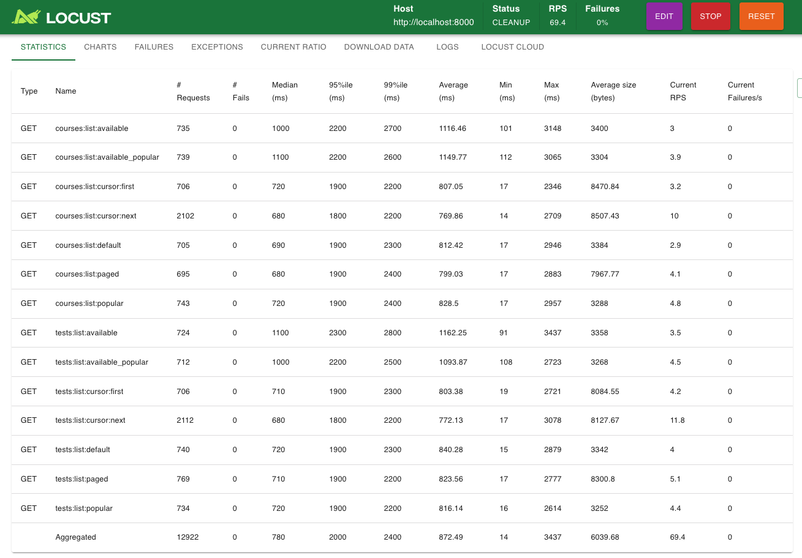
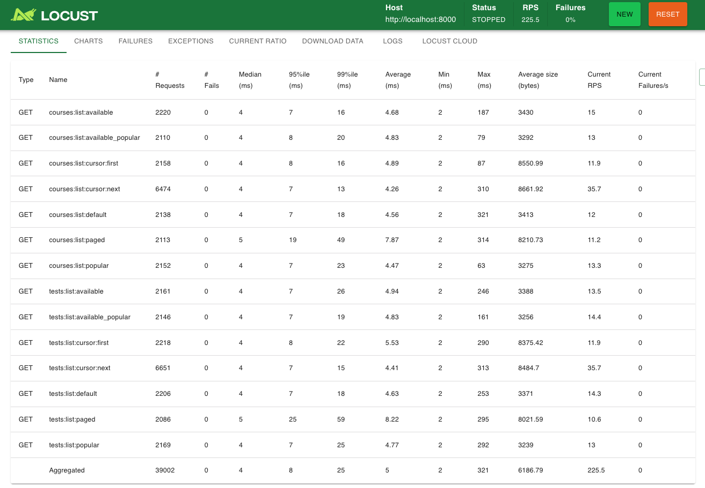

# Grepp 과제 제출 후 실제 개선 사항 정리 📑
- 응시자 : 조재영
- 개발 기간 : 2025년 9월 25일 ~ 2025년 9월 29일
- 성능 고도화 및 회고 : 2025년 10월 1일 (수) ~ 2025년 10월 10일 (금)

develop 브랜치는 성능 고도화 및 회고를 위한 페이지로 이용될 예정입니다.

 

# 목차 📚
- [pagenation 방식 변경](#change_pagenation)
 

# 1. pagenation 방식 변경
- 변경: LimitOffset → Cursor
- 이유: LimitOffset은 응답의 `count` 계산을 위해 매 요청마다 `COUNT(*)`를 수행해 비용이 큼.
- 효과: Cursor는 `count`를 계산하지 않아 `COUNT(*)` 쿼리가 제거됨.

- 쿼리 비교
  - 변경 전: LimitOffset 적용
    
  - 변경 후: Cursor 적용
    

- 부하테스트 
  - 하드웨어: MacBook Air (Apple M4, 32GB RAM)
  - 데이터 셋
    - seed 스크립트 start_with_make_seed_data.sh 사용
  - 조건
    - user : 100
    - ramp up : 5
    - run_time : 3m
  - 변경 전: LimitOffset 적용 
    
  - 변경 후: Cursor 적용
    

- 참고
  - PostgreSQL 은 정확성을 위해 COUNT(*) 는 전체 범위를 스캔(MySQL 은 row count 를 메타 데이터에 저장해서 조건이 없으면 O(1) 에 가깝게 반환)
  - 첫 페이지처럼 자주 조회되는 구간은 더 빠르게 응답.
  - 매우 뒤쪽 페이지로 갈수록 체감 차이는 줄어들 수 있음(하지만 `COUNT(*)` 비용이 없으므로 전반적으로 더 안정적).